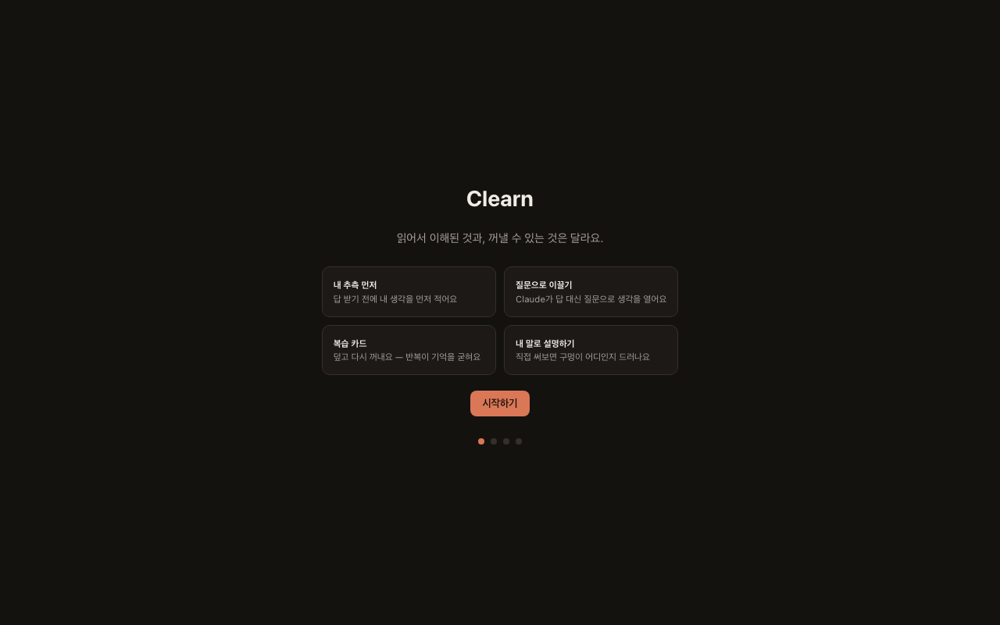
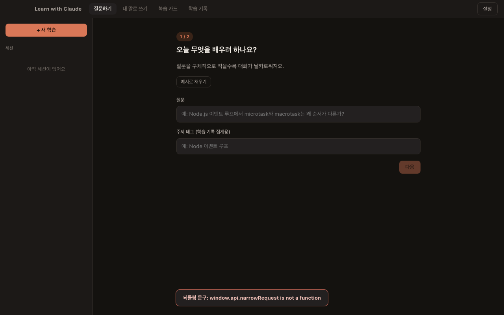
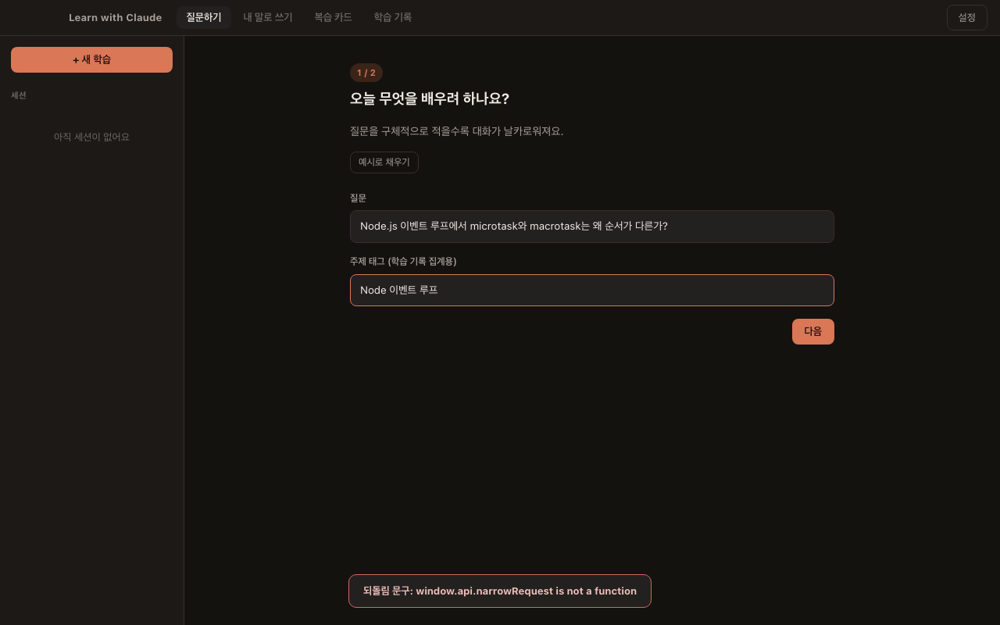
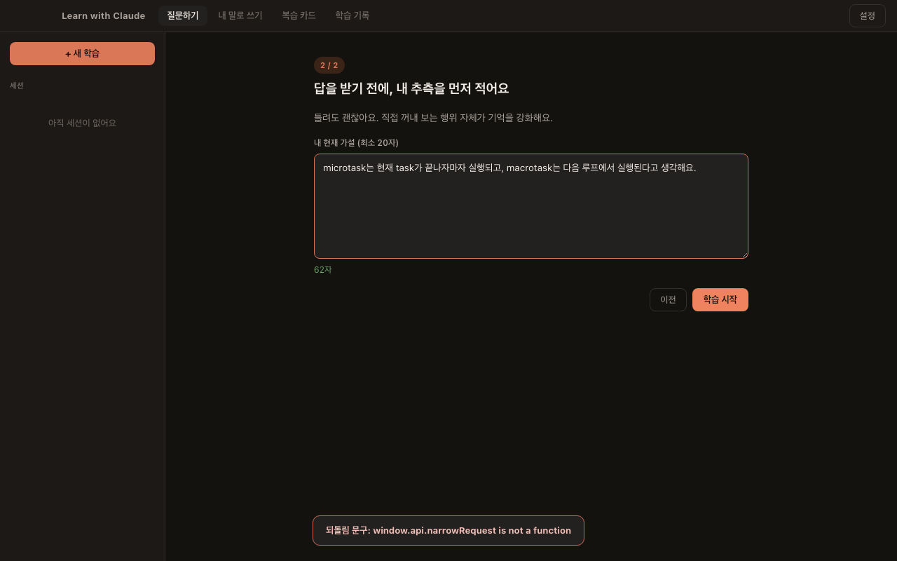
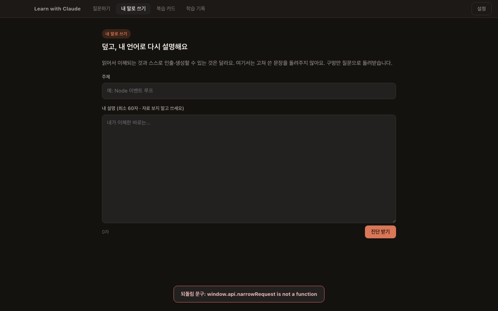
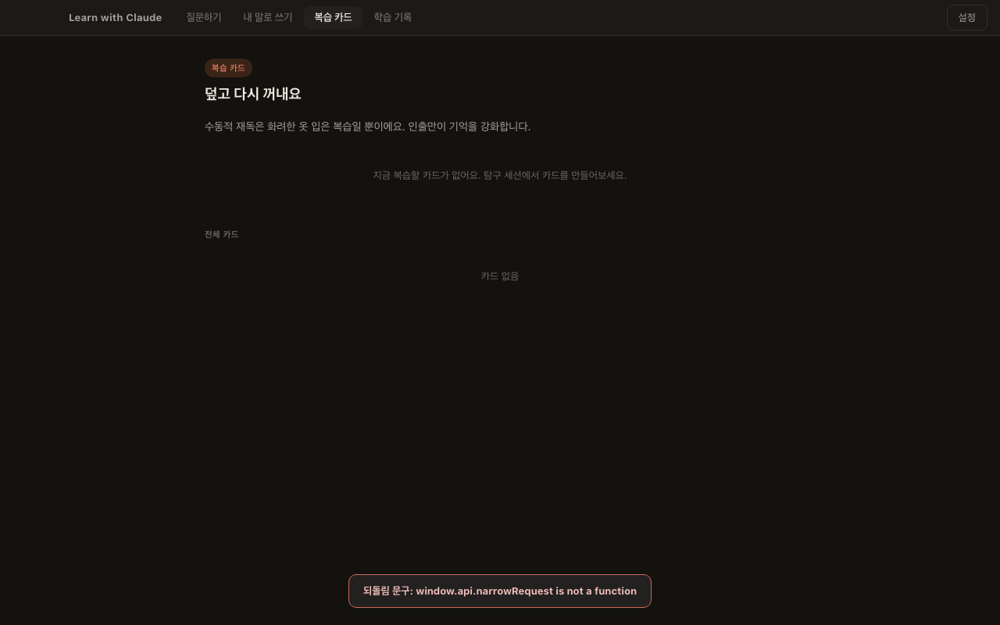
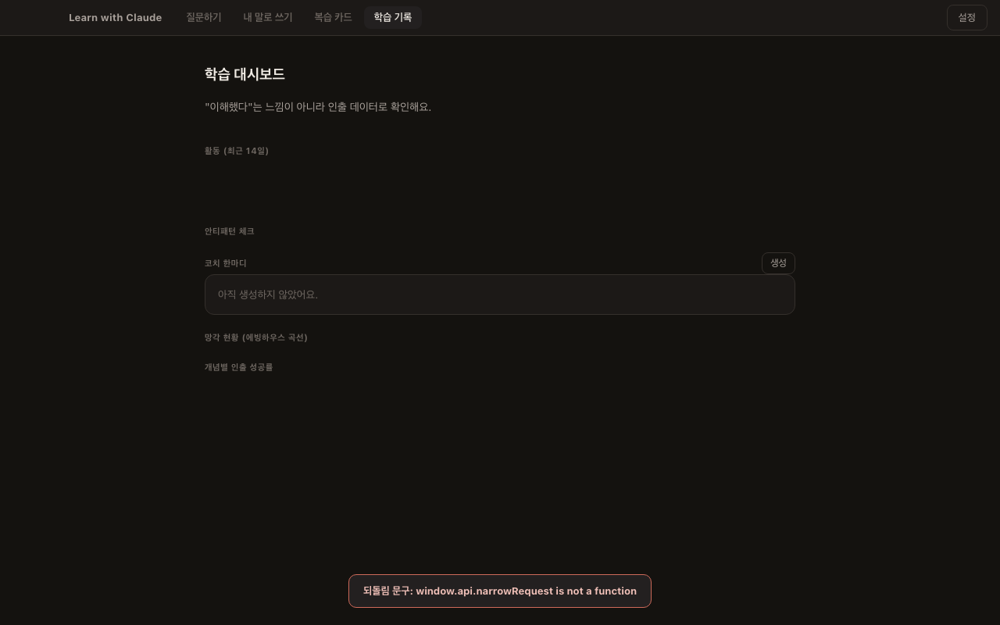

<div align="center">
  <h1>Clearn</h1>
  <p>읽어서 이해된 것과, 꺼낼 수 있는 것은 달라요.</p>
</div>

---

## 문제 정의

Claude를 열고 "이 개념 설명해줘"라고 물으면 3초 안에 유창한 답이 돌아온다. 읽으면 이해된다. 그러나 다음날 같은 개념을 스스로 설명해보려 하면 아무것도 나오지 않는다. 이것은 Claude 탓이 아니다. **수동적으로 받아읽는 행위는 기억을 거의 강화하지 않는다.** 기억을 강화하는 건 인출 시도, 즉 내 머리에서 꺼내보려는 행위 자체다.

문제는 Claude가 너무 친절하다는 것이다. 가설을 적기 전에 답을 주고, 막히기 전에 힌트를 주고, 설명을 요청하면 매끈하게 정리해준다. 이 편의들이 학습 기회를 하나씩 지워간다. Clearn은 이 편의를 의도적으로 차단한다. 답을 늦게 받고, 내 머리를 먼저 쓰게 만드는 것이 이 앱의 유일한 목적이다.

Clearn은 Claude Code 구독으로 동작하는 macOS 전용 Electron 앱이다. 별도 API 키가 없어도 `claude` CLI 로그인만 되어 있으면 AI 기능이 모두 작동한다.

---

## 서비스 포지셔닝

| | ChatGPT / Claude 직접 사용 | Anki | Notion AI 요약 | Clearn |
|---|---|---|---|---|
| 가설 없이 답 받기 | 가능 | N/A | 가능 | **차단** |
| AI가 설명을 써줌 | 가능 | N/A | 가능 | **차단** |
| 소크라테스식 대화 | 직접 프롬프트 필요 | N/A | 없음 | **기본값** |
| 인출 카드 + SM-2 간격 반복 | 없음 | 있음 | 없음 | **있음** |
| 자기설명 진단 (구멍 질문) | 없음 | 없음 | 없음 | **있음** |
| 학습 안티패턴 감지 | 없음 | 없음 | 없음 | **있음** |
| API 키 불필요 | 키 필요 | N/A | 키 필요 | **구독만** |

---

## 핵심 기능

Clearn의 설계는 4가지 학습 레버로 구성된다.

### 내 추측 먼저

질문을 입력한 뒤에는 내 현재 가설(최소 20자)을 적어야만 대화가 시작된다. 첫 턴은 내가 묻는 게 아니라 내 가설이 Claude에게 전송된다. Claude는 가설을 채점하거나 정답을 주지 않고, 가설에서 검증되지 않은 전제를 질문으로 되돌린다.

### 질문으로 이끌기

Claude는 답 대신 질문으로 응답한다. 기본은 L0(되묻기) 모드로, 힌트를 절대 주지 않고 하나의 질문만 던진다. 막힐 때 직접 단계를 올리면 L1(방향만) → L2(예시 보기) → L3(정답 보기) 순으로 열린다. L3(정답 공개)는 확인 대화상자를 거치고 기록에 남는다. 한 응답에 질문은 반드시 하나다 — 코드로도 강제된다.

### 복습 카드

대화가 끝나면 대화 기록에서 인출 카드를 자동 생성할 수 있다. 카드는 SM-2 알고리즘으로 간격 반복 복습 일정이 잡힌다. 복습 시 모범 답안은 내가 직접 답을 적은 뒤에만 공개된다.

### 내 말로 설명하기

자료를 덮고 내가 배운 것을 직접 글로 쓰면 Claude가 진단만 해준다. 고쳐 쓴 문장은 절대 돌려주지 않는다. 틀린 부분, 빠진 부분, 뭉갠 부분마다 스스로 메울 수 있는 질문으로 돌려받는다.

---

## 서비스 흐름

### 1. 온보딩

처음 실행 시 4단계 흐름이 열린다. 앱 소개 카드 확인 → Claude Code 연결 확인 → Obsidian 보관함 연동(선택) → 학습 시작.



### 2. 게이트 — 질문과 가설 입력

"질문하기" 탭에서 새 학습을 시작하면 2단계 게이트가 열린다.

- 1단계: 오늘 배우려는 질문과 주제 태그 입력
- 2단계: 내 현재 가설 입력 (20자 미만이면 시작 버튼이 비활성)







### 3. 소크라테스 튜터 대화

가설이 제출되면 채팅이 열린다. Claude는 질문 하나로만 응답한다. 우측 상단의 힌트 사다리를 직접 눌러야 힌트가 단계적으로 열린다. 대화가 쌓이면 "복습 카드 만들기" 버튼이 나타난다.

### 4. 내 말로 쓰기 탭

주제와 내 설명을 적고 "진단 받기"를 누르면 정확/오류/누락/뭉갬 4가지로 분류된 진단과 0~100점 점수가 반환된다.



### 5. 복습 카드 탭

오늘 복습할 카드 큐가 표시된다. 질문을 보고 답을 적은 뒤 제출하면 0~5점으로 채점되고 다음 복습일이 자동 계산된다.



### 6. 학습 기록 탭

KPI(세션 수, 자기설명 수, 카드 수, 인출 성공률), 14일 활동 스파크라인, 안티패턴 플래그 6종, 개념별 인출 성공률, AI 코치 한마디를 확인할 수 있다.



---

## 기술 스펙

### 아키텍처

```
┌─────────────────────────────────────┐
│         Electron Main Process       │
│  main.js  agent.js  store.js        │
│  obsidian.js  prompts.js            │
│  ↕ IPC (preload.cjs bridge)         │
├─────────────────────────────────────┤
│       Electron Renderer Process     │
│  index.html  app.js  styles.css     │
└─────────────────────────────────────┘
         ↕ Claude Agent SDK
    로컬 Claude Code 구독 인증
```

- Main Process: Node.js ESM, IPC 핸들러, 파일 I/O, Claude SDK 호출
- Renderer Process: 순수 HTML/CSS/JS (프레임워크 없음), IPC 통신
- preload.cjs: contextBridge로 IPC를 `window.api.*`로 노출
- 인증: `~/.claude` 로컬 Claude Code 로그인 (구독 필수, API 키 불필요)

### 핵심 모듈

| 파일 | 역할 |
|------|------|
| `src/main/main.js` | IPC 핸들러 전체, 알림 스케줄러 |
| `src/main/store.js` | JSON 영속성, SM-2 SRS 스케줄러, 안티패턴 감지 |
| `src/main/agent.js` | Claude Agent SDK 래퍼 (스트리밍, abort, JSON 헬퍼) |
| `src/main/prompts.js` | 4가지 레버 프롬프트 전체 — 튜닝은 여기서만 |
| `src/main/obsidian.js` | Obsidian 보관함 내보내기 + 개념 허브 DAG |
| `src/main/preload.cjs` | contextBridge IPC bridge |
| `src/renderer/app.js` | 렌더러 전체 로직 (Vanilla JS) |
| `src/renderer/index.html` | UI 진입점 |
| `src/renderer/styles.css` | CSS 변수 기반 다크 테마 |

### AI 연동

Claude Agent SDK(`@anthropic-ai/claude-agent-sdk`)를 통해 로컬 Claude Code 구독 인증을 그대로 사용한다.

```js
query({ prompt, options: {
  allowedTools: [],        // 툴 전혀 안 씀 — 순수 대화
  settingSources: [],      // CLAUDE.md / 프로젝트 설정 미로드
  systemPrompt: '...',     // 완전 커스텀 튜터 페르소나
  includePartialMessages: true,
  resume: sdkSessionId,    // 멀티턴 컨텍스트 유지
}})
```

프롬프트 설계 원칙:
- 모든 프롬프트는 "완성된 답을 먼저 주지 않는다"는 가드레일을 공유한다
- HINT_LADDER(L0~L3)로 힌트 단계를 분리하고, 매 턴 `[HINT_LEVEL=n]` 지시문을 주입한다
- "한 응답에 질문 하나" 규칙은 프롬프트와 `countQuestions()` 코드 백스톱 두 겹으로 강제된다

### 데이터

모든 데이터는 로컬 JSON 파일로 저장된다. 원자적 쓰기(tmp 파일 후 rename), 자동 백업(최근 10개), 손상 시 자동 복구를 지원한다.

```
~/Library/Application Support/Learn with Claude/
├── data.json          세션 · 카드 · 자기설명 · 이벤트
└── backups/           자동 백업 (최근 10개 유지)
```

SRS는 SM-2 알고리즘 자체 구현. 스키마 변경 시 `store.js`의 `SCHEMA_VERSION`을 올리고 `MIGRATIONS`에 마이그레이션 함수를 추가한다.

### Obsidian 연동

자기설명 진단 직후 Obsidian 보관함에 노트를 자동 내보낼 수 있다 (설정에서 on/off).

- 본문 = 내가 쓴 자기설명 그대로 (Claude 요약 없음)
- Claude 진단은 `> [!warning]` callout으로 분리
- 개념마다 허브 노트 생성, `[[wikilink]]`로 연결, 인출 성공률 기록
- 인출 카드는 spaced-repetition 플러그인 포맷으로 함께 내보냄
- 재내보내기 시 직접 추가한 메모는 보존 (`<!-- learn-with-claude:begin/end -->` 마커)

---

## 설치 및 실행

### 요구사항

- macOS 12+ (Apple Silicon 권장)
- [Claude Code](https://claude.ai/code) 설치 및 로그인 (`claude` 명령 사용 가능 상태)

### DMG로 설치 (일반 사용자)

GitHub Releases에서 최신 `.dmg`를 다운로드한 뒤 설치한다.

코드 서명이 없어 Gatekeeper 경고가 뜰 수 있다. 그 경우 터미널에서:

```bash
xattr -dr com.apple.quarantine /Applications/Clearn.app
```

### 개발 환경

```bash
git clone https://github.com/tomchaccom/Clearn.git
cd Clearn
npm install
npm start        # 개발 모드 (Electron 직접 실행)
npm test         # 단위 + 통합 테스트 (모델 호출 없음)
npm run dist     # .dmg 빌드 → dist/
```

### 코드를 수정했을 때

| 수정한 파일 | 반영 방법 |
|---|---|
| `src/renderer/**` (HTML · CSS · app.js) | `Cmd+R` 새로고침 |
| `src/main/**` · `preload.cjs` | `Cmd+Q` 후 `npm start` 재시작 필요 |

---

## 라이선스

MIT

